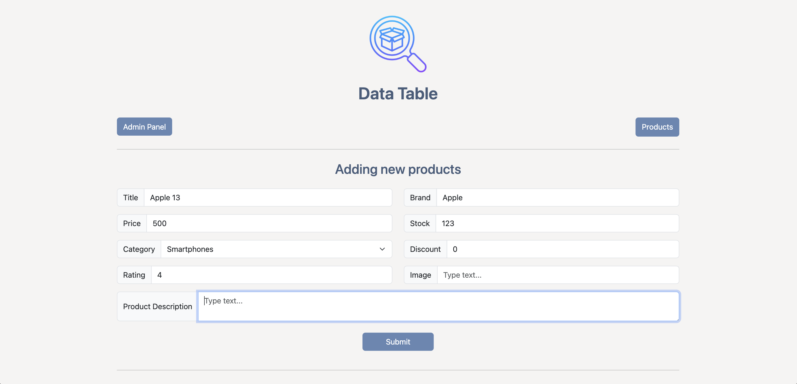
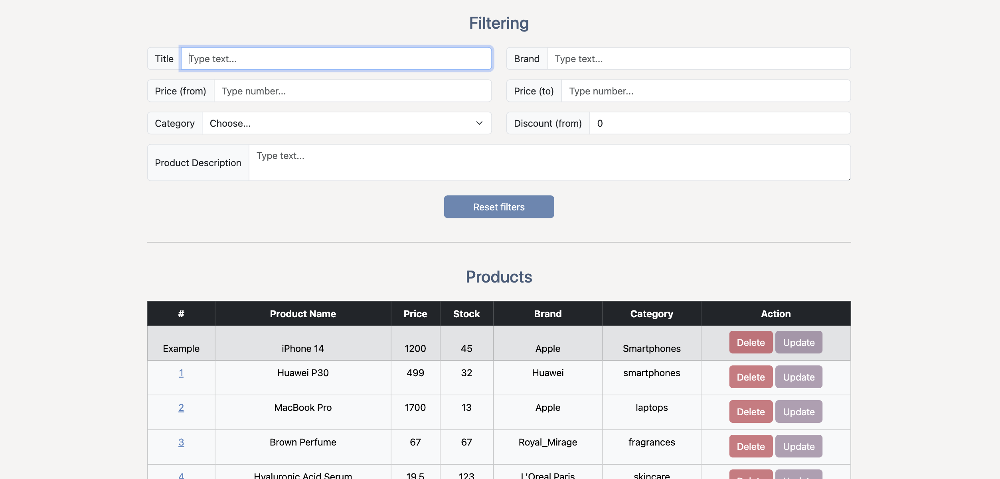
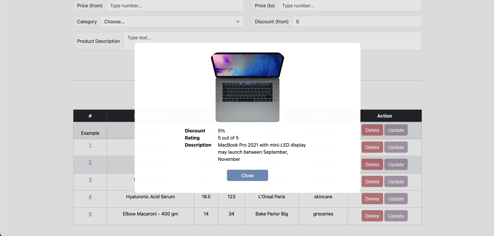
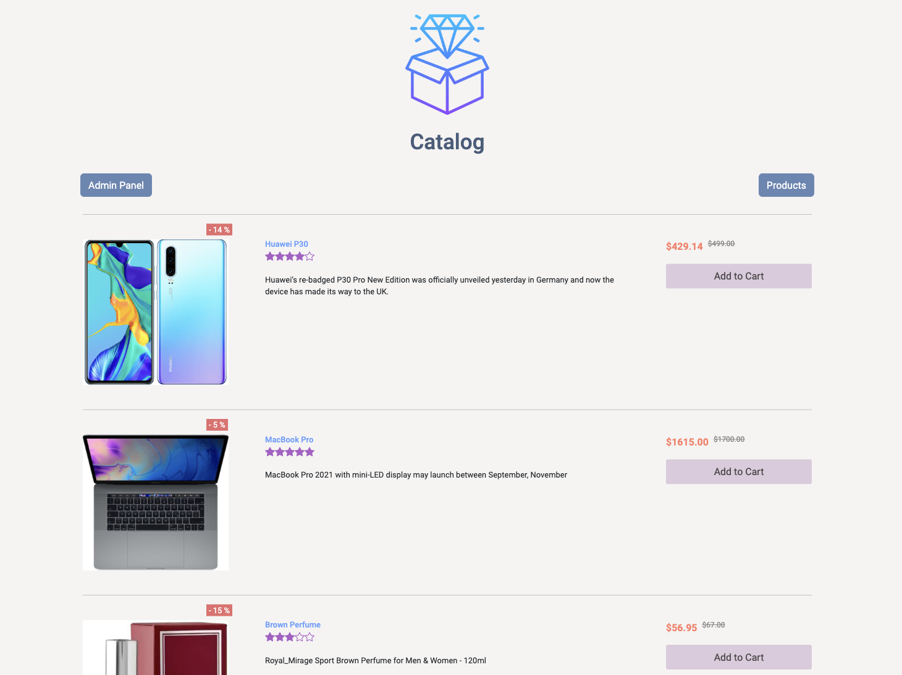
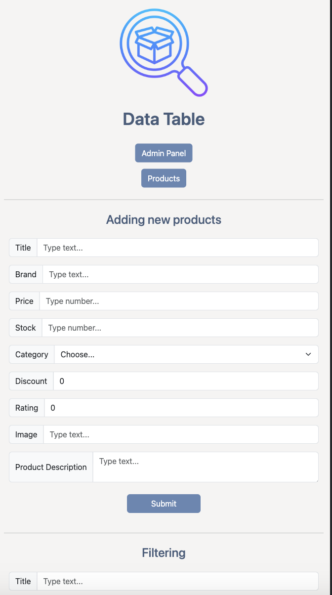
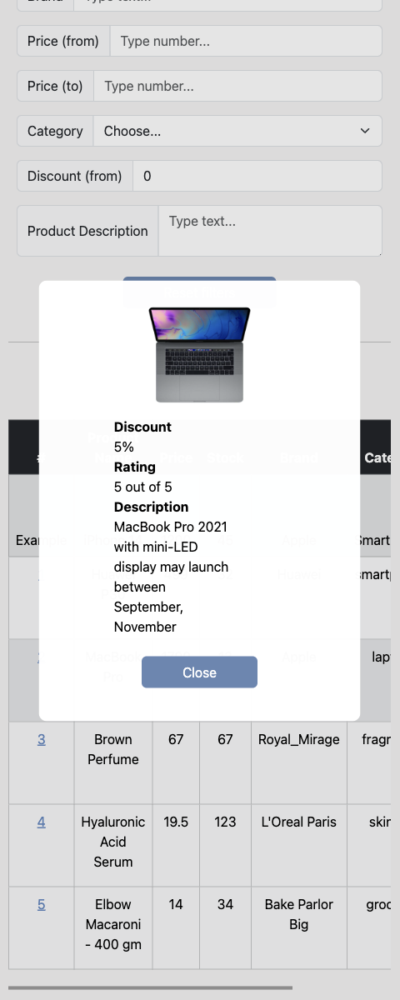
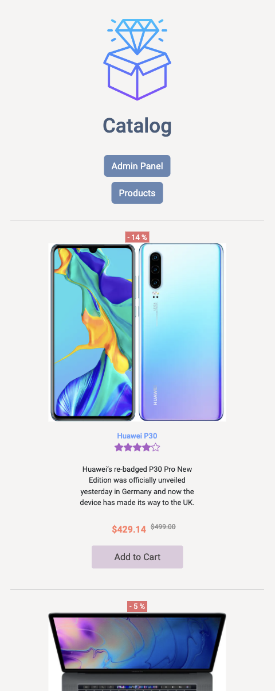

#  Data-table App

Responsive application is developed using javascript and bootstrap that combines the catalogue (representation of the products) and the CRUD table that is used to manage the product list. 

Main tasks:
 • Implement CRUD.
 • Saving/Rendering products with localStorage
 • Implement modal window (#).
 • Implement modal window (opens by clicking on the product ID).
 • Implement filtering function.
 • Add validations.
 • Create a navigation element to navigate between the administration panel (table) and the product list(catalogue)

<h4>🔹  Data table app sample - <a href="https://simonakom.github.io/data-table-app/admin.html" style="font-size:small;">View</a><h4>

### Desktop version:

    
    
    
    

### Mobile version:
   
   
   

